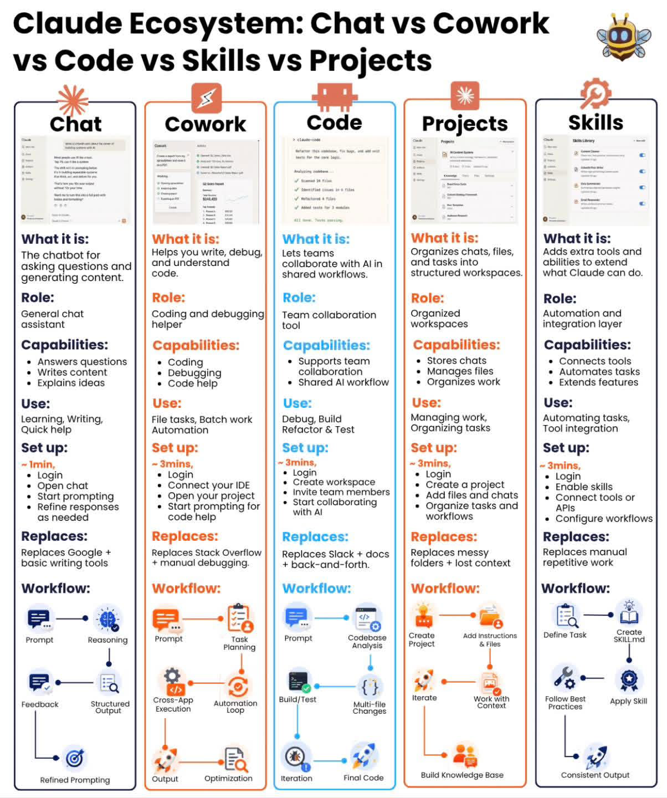

# Claude Family — 5 個 Claude 產品的工作流定位

> 來源：LinkedIn 風格行銷文（作者署名 jamesCodeLab）；定位為「實務用戶如何挑選 Claude 產品」的速查表，非 [[Anthropic]] 官方對外文件。
>
> 配圖（2026-05-07 ingest）：`raw/assets/claude-ecosystem-5-products-20260507.png` — 同主題視覺資訊圖「Claude Ecosystem: Chat vs Cowork vs Code vs Skills vs Projects」，七面向（What it is / Role / Capabilities / Use / Set up / Replaces / Workflow）對比。

## 核心主張

> Your company doesn't care if you "know AI." They care how many Claude tokens you can turn into outcomes.

文章將 [[Anthropic]] 旗下產品定位為 5 個對應「工作流階段」的工具，每個都有最佳場景與不適用場景。最終結論：「Most teams use Claude Chat for everything and hit limits. The teams winning with Claude use the right product for each workflow.」

## 5 產品速覽表

| # | 產品 | 角色定位 | 適用 | 不適用 |
|---|------|----------|------|--------|
| 1 | Claude Chat | Thinking Partner | 想法、寫作、解釋、研究；深度推理 + 長篇回應 | 檔案、自動化、系統操作 |
| 2 | Claude Cowork | Workflow Automator | 檔案任務、批次工作、自動化、跨 app 任務執行 | 推理、創意思考 |
| 3 | [[Claude Code]] | Engineering Agent | 除錯、建構、重構、測試；多檔案程式理解 | 創意發想、非技術任務 |
| 4 | Claude Skills | Capability Extender | 模板、重複任務、一致重複工作流 | 一次性或探索性任務 |
| 5 | Claude Projects | Context Keeper | 持續專案、長期記憶 + 上下文 | 快速一次性任務 |

## 配圖補充：Set up 時間與「取代什麼」

視覺資訊圖比上方表格多出三個面向（取自 2026-05-07 配圖）：

| 產品 | Set up | 取代（Replaces） |
|------|--------|------------------|
| Chat | ~1 min | Google + 基本寫作工具 |
| Cowork | ~3 min | Stack Overflow + 手動除錯 |
| Code | ~3 min | Slack + docs + 來回溝通 |
| Projects | ~3 min | 凌亂資料夾 + 遺失的上下文 |
| Skills | ~3 min | 手動重複工作 |

> 「取代什麼」欄位是行銷敘事重點——把每個 Claude 產品定位為某個既有工作習慣的替代品，強化「不只是聊天工具」的訊息。對應 [[src-anthropic-founders-playbook]] 三工具分工（Chat/Cowork/Claude Code）的官方版切分。

## 各產品具體場景

### 1. Claude Chat — Thinking Partner

- **範例**：寫一篇 AI 趨勢部落格 → Chat 研究、列大綱、起草、精修論點
- 觀察：這是大眾接觸 [[Anthropic]] 的入門產品；對應 claude.ai 的對話介面

### 2. Claude Cowork — Workflow Automator

- **範例**：從 50 份 PDF 抽取資料、整理成試算表、發送摘要 email → Cowork 自動化整個流程
- 觀察：定位接近「桌面自動化 agent」
- ✅ **已確認**：[[src-anthropic-managed-agents]] 的 raw（claude.com 官網導覽列）確認 `Claude Cowork` 是真實 [[Anthropic]] 產品；官方產品線為 Claude / Claude Code / **Claude Cowork** / **Claude Security** / Skills / Managed Agents（beta）

### 3. Claude Code — Engineering Agent

- **範例**：建構觸及 10 個檔案的功能 → 分析 codebase、寫程式、更新測試、重構
- 對應 wiki 既有 [[Claude Code]] 頁與 [[src-Claude Code五個底層概念]] / [[src-Claude Code Routines]] / [[src-Claude Code Session管理]]

### 4. Claude Skills — Capability Extender

- **範例**：每週寫 LinkedIn 文章 → 建立 Skill 含格式規則，每篇遵循同樣風格
- 對應 wiki 既有 [[Skill vs Bash vs MCP]] 概念頁
- 與 [[src-andrej-karpathy-skills]] / [[src-mattpocock-skills]] / [[src-addyosmani-agent-skills]] / [[src-wshobson-agents]] 等 skill 集合直接相關

### 5. Claude Projects — Context Keeper

- **範例**：管理含上百份文件的產品發布專案 → Projects 記住一切、上下文跨 session 持續
- 觀察：[[Anthropic]] 用以對比 ChatGPT 的「Projects」功能，皆屬「context 持久化」競爭

## 商業敘事策略

文章的核心修辭手法：

1. **痛點開場**：「公司不在乎你懂不懂 AI，只在乎你能不能把 token 變成成果」——將 AI 焦慮轉化為「ROI 焦慮」
2. **錯誤敘事**：「多數團隊把 Chat 當萬用工具，所以撞牆」——暗示讀者「你正在錯誤使用」
3. **解方矩陣**：5 產品 = 5 個工作流階段（思考 / 標準化 / 持久化 / 建構 / 自動化）——LinkedIn 演算法偏愛「N 個要點」格式

這對應 wiki 既有 [[src-claude-for-creative-work]] 與 [[src-anthropic-managed-agents]] 的 [[Anthropic]] 對外溝通模式：強調「正確使用 Claude」而非「Claude 比 X 強」。

## 跨 wiki 連動

- **[[Anthropic]]**：5 產品線是 Anthropic 商業矩陣的對外簡化版
- **[[Claude Code]]**：5 產品中唯一已建獨立頁的產品
- **[[Skill vs Bash vs MCP]]**：Claude Skills 的能力擴展定位與該頁的工具分類學一致
- **[[src-Claude Code五個底層概念]]**：Claude Code 的內部結構與此處「engineering agent」對外定位的接口
- **[[src-claude-for-creative-work]]**：Anthropic 對 Claude Chat 的「創意工作夥伴」定位，與此處「Thinking Partner」一致

## 來源限制與查核

- ⚠️ **來源類型**：LinkedIn 行銷文（個人創作者，非 Anthropic 官方）；資訊準確度為「市場流通理解」非「產品文件」
- ✅ **Claude Cowork**：經 [[src-anthropic-managed-agents]] raw 確認為真實 [[Anthropic]] 產品（官網導覽列）
- ⚠️ **角色定位**：5 產品分類為作者個人歸納；[[Anthropic]] 官方產品線為 6 個（多了 Claude Security），切分方式與此文略有出入

## 結語金句

> Each product handles a different stage. Chat thinks. Skills standardize. Projects persist. Code builds. Cowork automates.

如要把這 5 個動詞作為產品定位記憶卡：**Thinks / Standardizes / Persists / Builds / Automates**——對應 5 個工作流階段。
